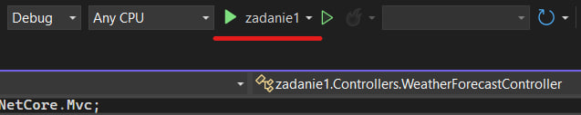
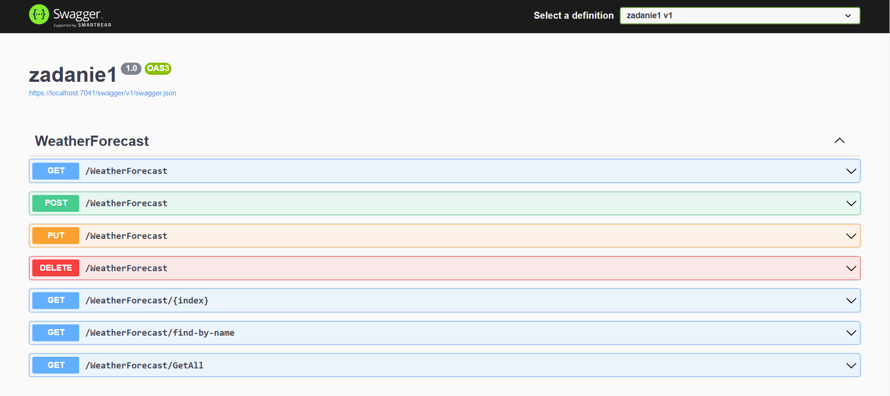

# MyProject
 ## Индивидуальный проект по теме: мой первый API 
 Мой проект предназначен для демонстрации практического обучения основам работы с ASP.NET API и являет собой полную сборку выполненного задания.

 
## Требования
Для того, чтобы воспользоваться материалом, а точнее, запустить его, необходимо иметь на борту ~~два гига два ядра, игровую видеокарту~~ следующие элементы:
1. .NET версии 6.0
2. Visual Studio 2022 
3. Пакет языка C# (желательно последней версии)
## Установка
Процесс установки максимальной простой: скачайте архив проекта и распакуйте его в любое удобное место на диске.
## Использование
После скачивания/установки, достаточно лишь открыть папку zadanie1 и запустить файл zadanie1.sln. Как только проект откроется в среде разработки Visual Studio 2022 (актуально на момент написания инструкции), запустите его нажатием на кнопку запуска (см. фото)

После этого, у вас запустится браузер со ссылкой на Swagger UI, где вы сможете в полной мере опробовать возможности данной программы.

